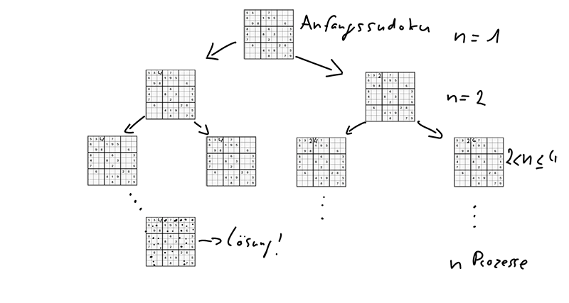
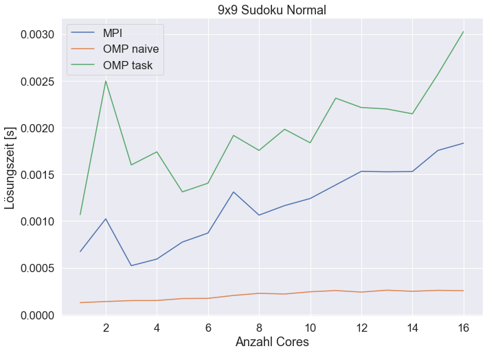
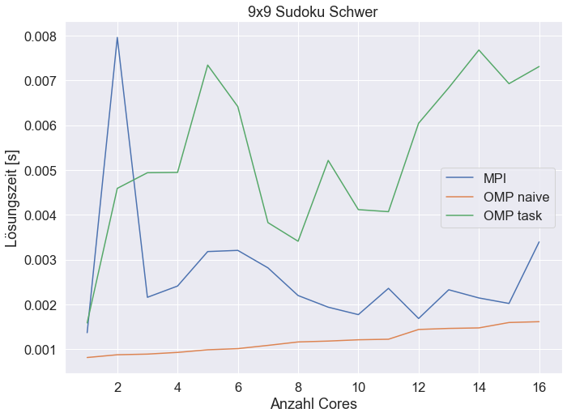
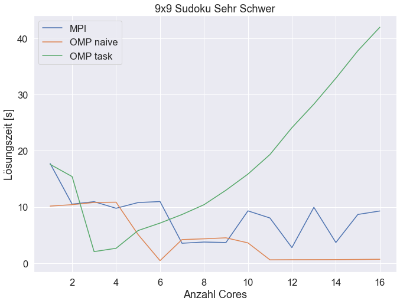
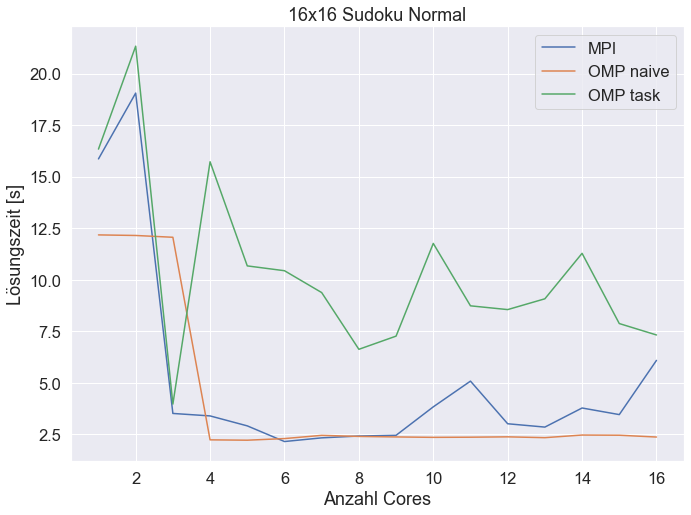
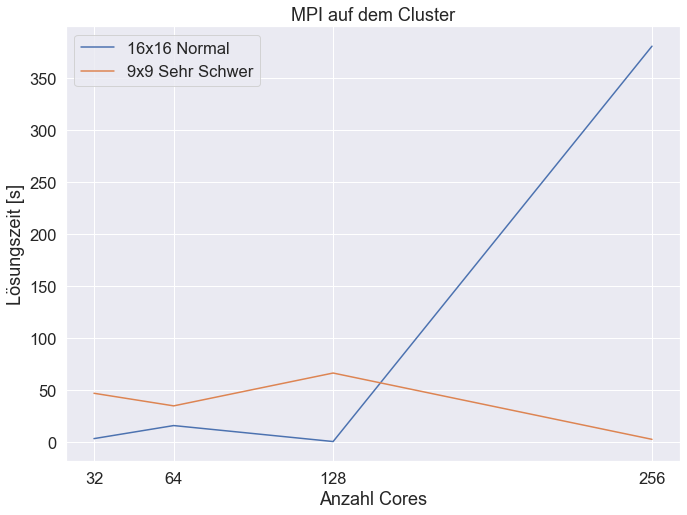

### Autoren:
Florian Neufeld
Konstantin Daitche
Kamil Jurczenko
### Sprecher:
Kamil Jurczenko 

## Dokumentation:
Ein Sudokufeld wird mithilfe des Backtracking Algorithmus (äquivalent zu einer Tiefensuche eines Graphens) gelöst. Hierfür wird sudoku_seriell.c von "Pradeep Mondal P" verwendet [1], wobei ein Sudokufeld als nxn Matrix betrachtet wird (n ist die Größe des Sudokus).

Der Algorithmus verläuft folglich als Pseudocode:
	
	(1) solveSudoku aufrufen
		(2) Abbruchbedingung: 1 Ausgeben falls im letzten Feld <=> Lösung gefunden
		(3) Iteriere solange durch das Sudokufeld bis ein leeres Feld gefunden wurde (ein Feld = 0 ist)
		(4) Iteriere solange durch i <= n bis i in das Feld passt (legal nach Sudokuregeln ist)
			(4.1) Wenn eine Zahl gefunden wurde dann gehe ein Feld weiter und führe (1) rekursiv aus
			(4.2) Gebe 0 aus falls keine Zahl gefunden wurde und gehe ein Feld zurück und probiere die nächsthöhere Zahl aus (Backtracking)
	
Dieser Algorithmus hat im schlimmsten Fall eine exponentielle Laufzeit von z^N und ist dementsprechend sehr Aufwendig.
Dieses Problem lässt sich unter Umständen parallelisieren. Da der Algorithmus rekursiv verläuft, wird eine Parallelisierung der Lösungsfindung problematisch, weshalb alternative Lösungen gefunden werden müssen.
		
Man Stelle sich eine Sudoku und alle möglichen Einträge in den Feldern als einen Graphen vor, wobei ein Knoten ein Sudoku sei. Die Wurzel ist das Sudoku was gelöst werden soll und die Kinderknoten weitere Sudokus die aus dem Wurzelsudoku stammen und ein weiteres gefülltes Feld besitzen. Um die Traversierung des Baumes zu parallelisieren muss der gesamte Baum in einzelne Bäum/Äste geteilt werden, damit ein Prozess diesen abbarbeiten kann. Das Problem ist jedoch die Bereitstellung dieser Äste worauf einige Strategien entwickelt wurden.

## Probleme:
- Es werden eine begrenzte Anzahl von Prozessen benötigt, weil, vor allem in weniger komplexen Sudokus, beispielsweise nur maximal 50 Knoten in einer Tiefe im Graphen vorkommen können und die komplette Leistung des Clusters nicht ausgenutzt werden kann. 
- Zu Variante (2) Einige Prozesse finden schnell keine Lösung und müssen warten wenn keine Teilsudokus mehr übrig sind, während andere Prozesse lange rechnen.

## Parallelisierungsvarianten			
Es wurde mit Hilfe von MPI und Open MP in der Programmiersprache C parallelisiert.
##### (1) Variante mit MPI
- Prozess 1 erstellt die Sudokus, während alle restlichen Prozesse warten. Nach der Erstellung gibt Prozess 1 jedem verfügbaren Prozess ein Sudoku, mit dem dann eine Lösung gesucht wird.
 Findet ein Prozess keine Lösung dann sendet dieser eine Nachricht an Prozess 1 und fragt nach einem neuen Sudoku, falls vorhanden.
 Der Ablauf wird solange wiederholt bis keine Sudokus mehr vorhanden sind, oder irgendwo schon eine Lösung gefunden wurde.

##### (2) Naive Variante mit OMP
- Jeder Prozess ruft initParallel und es entstehen Redundanzen. 
Es kann jedoch jeder Prozess ein Sudoku abbarbeiten, wohingegen bei Variante 1 ein Prozess zum Managment verwendet wird der nie Sudokus abbarbeitet.

##### (3) OMP mit rekursiven Tasks
- Der Master Thread führt auf die Berechnungsmethode eine Task aus. In jedem Task werden weitere Tasks ausgeführt, falls weitere Knoten folgen.
    - Hierbei werden nur so viele Tasks erstellt wie Anzahl Threads um overhead zu vermeiden.

Für die Parallelisierung von Methode (1) und (2) wurde eine Hilfsmethode implementiert der den Graphen mithilfe einer Breitensuche traversiert und Sudokufelder zwischenspeichert(initParallel()). Dies wird ausgenutzt, damit vor der eigentlichen Parallelisierung genug Sudokufelder für Prozesse vorhanden sind. Die Breitensuche wird solange ausgeführt bis in einer Tiefe/Ebene im Graphen mindestens so viele Knoten wie Prozesse existieren. Falls es mehr Startsudokus als Prozesse gibt, dann werden diese gespeichert, damit ein Prozess der sein Anfangssudoku abgearbeitet hat, versuchen kann ein weiteres Sudoku zu lösen.

## Messungen

Die Messungen wurden mit einer Stichprobe von 10 je Core (bis 16 Cores) durchgeführt. Messungen über 16 Cores wurden auf dem Cluster mit einer Stichprobe von 5 geführt.

			

Ein 9x9 Sudoku mit normaler Schwierigkeit zeigt sich als kein Problem für einen Computer. Es dauert 0.5 bis 1 Millisekunden, um das Sudoku seriell zu lösen. MPI (1) und OMP mit Tasks (3) zeigen bei der Parallelisierung Overhead bis zu Verdoppelung der Zeiten mit 8 Cores. 

	

Schwere 9x9 Sudokus dauern mindestens doppelt so lange wie mit normaler Schwierigkeit. Bemerkenswert ist der Anstieg bei 2 Cores in MPI. Dies durch die Caching Strategie zu erklären, weil vermutlich das erste Sudoku, welches zwischengespeichert wird, die Lösung des Sudokus enthält. Die MPI Methode ist außerdem bei 2 Cores sinnlos, weil hierfür kein "Manager" Prozess benötigt wird, der nur einen Prozess verwaltet.

	

Verglichen mit dem schweren 9x9 Sudoku ist ein sehr schweres 9x9 Sudoku anspruchsvoller zu berechnen.
OMP task scheint mit der Anzahl der Cores schlecht zu skalieren. Begründen lässt sich dies durch die Speicher Alloziierung und Freistellung von neuen Sudokufeldern, die bei jedem Erstellen einer neuer Task durchgeführt wird, damit jeder Task eine neue Sudokukopie bekommt. 

	

	
			
## Fazit
Der Sudokubaum skaliert mit der Schwierigkeit und der Größe des Wurzel-/Anfangssudokus im Graphen und es dauert länger diesen zu lösen.
Die naive OMP Methode skaliert mit der Core Anzahl, von allen gemessenen Parallelisierungsvarianten, am besten. Obwohl diese Variante am ineffizientesten scheint, weil viele Threads warten müssen wenn keine Anfangssudokus mehr übrig sind, ist diese jedoch die schnellste von allen getesteten Methoden.
Es zeigte sich, das die Implementation von Methode (2) und (3) mit OMP mit wenigeren Zeilen Programmiercode als mit (1) mit MPI. 
Dadurch das man bei OMP mit einem gemeinsamen Speicher arbeitet, wird keine Kommunikation wie bei MPI benötigt und vieles erleichtert. Zusätzlich wird das Scheduling durch OMP realisiert, wodurch man kein "Manager" Thread benötigt der jedem Thread ein Sudoku schickt.

Idealerweise hat man bei 2 Prozessen und Cores eine halbierung der Berechnungszeit als bei nur einem Prozess und Core. Die Messungen zeigten aber das man bei einem 16x16 Sudoku mit Normaler Schwierigkeit mit dem Parallelisierungsverfahren bei 16 Prozessen
und Cores nur eine sehr geringe Verbesserung von ca 0.7 Sekunden verglichen mit nur einem Prozess aufweist (siehe rawdata\old data\mpi\sudokuNormal16). 

Referenzen:
[1]https://www.geeksforgeeks.org/sudoku-backtracking-7/
Daten aus \rawdata\new data
